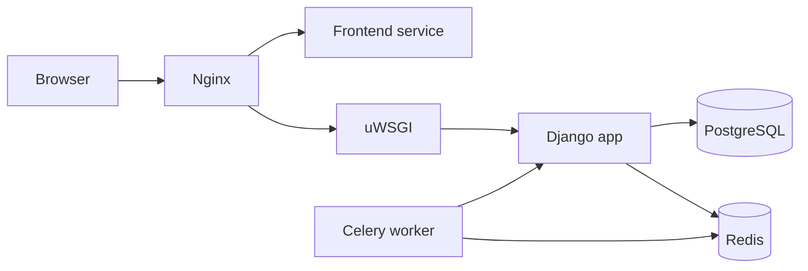
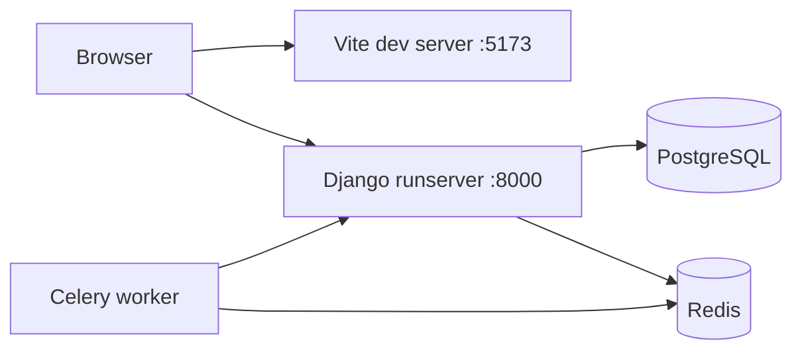

# SnapURL

SnapURL is a full-stack URL shortener composed of:

- a Django REST backend
- a React + Vite frontend
- PostgreSQL for persistence
- Redis and Celery for asynchronous work
- an Nginx + uWSGI production-oriented serving path

## Table of Contents

- [Project Overview](#project-overview)
- [Architecture](#architecture)
- [Tech Stack](#tech-stack)
- [Repository Layout](#repository-layout)
- [Local vs Production](#local-vs-production)
- [Environment Variables](#environment-variables)
- [Running Locally](#running-locally)
- [Running the Production-Oriented Stack](#running-the-production-oriented-stack)
- [Service Reference](#service-reference)
- [How Nginx and uWSGI Work Here](#how-nginx-and-uwsgi-work-here)
- [Docker and Configuration Files](#docker-and-configuration-files)
- [Common Commands](#common-commands)
- [Validation Checklist](#validation-checklist)
- [Troubleshooting](#troubleshooting)
- [Production Hardening Notes](#production-hardening-notes)

## Project Overview

SnapURL lets users create short links, authenticate, inspect analytics, and manage their dashboard from a React frontend backed by a Django API.

The project is structured so development remains convenient while production concerns are isolated into dedicated files:

- Django settings are split into base, development, and production variants
- Docker Compose is split into development and production-oriented definitions
- Nginx and uWSGI are only part of the production-oriented path
- the frontend uses a different API base URL strategy depending on the environment

## Architecture

### High-Level Production-Oriented Flow



### Local Development Flow



## Tech Stack

### Backend

- Python 3.11
- Django
- Django REST Framework
- Simple JWT
- Celery
- Redis
- PostgreSQL
- uWSGI

### Frontend

- React
- Vite
- Axios
- React Router
- Recharts
- Bootstrap / React Bootstrap

### Infrastructure

- Docker
- Docker Compose
- Nginx
- uWSGI

## Local vs Production

This is the most important distinction in the repository.

| Concern               | Local development                       | Production-oriented stack                       |
| --------------------- | --------------------------------------- | ----------------------------------------------- |
| Django settings       | `config.settings.dev`                   | `config.settings.prod`                          |
| Backend server        | `runserver`                             | `uWSGI`                                         |
| Public entrypoint     | Frontend on `:5173`, backend on `:8000` | Nginx on `:80`                                  |
| Frontend mode         | Vite development server                 | `vite build` + `vite preview`                   |
| API base URL          | `http://localhost:8000/api/v1`          | `/api/v1/` through Nginx                        |           |

### Local Development Characteristics

Local mode is designed for fast feedback:

- backend code is mounted into the container
- Django runs with `runserver`
- frontend runs in Vite dev mode
- backend and frontend are directly reachable on separate ports
- security settings are intentionally relaxed

### Production-Oriented Characteristics

Production-oriented mode is designed to mimic how the application should be served in deployment:

- Nginx becomes the public HTTP entrypoint
- uWSGI serves Django instead of `runserver`
- frontend assets are built before being previewed
- API traffic flows through Nginx
- production settings are loaded from `config.settings.prod`
- secure settings are environment-driven so you can test locally before enabling full HTTPS enforcement

## Running Locally

### Prerequisites

- Docker Desktop or Docker Engine with Compose
- Git
- optional: `just` if you want shortcut commands

### Start the Local Stack

```bash
docker compose up --build
```

Or with `just`:

```bash
just dev
```

### Local Endpoints

- Frontend: http://localhost:5173
- Backend API root namespace: http://localhost:8000/api/v1/
- Django admin: http://localhost:8000/admin/
- PostgreSQL host port: `5433`
- Redis: `6379`
- RedisInsight: http://localhost:5540

## Running the Production-Oriented Stack

### Start the Production-Oriented Stack

Use the production compose file directly:

```bash
docker compose --env-file .env.prod -f docker-compose.prod.yml up -d --build
```

### Stop It

```bash
docker compose --env-file .env.prod -f docker-compose.prod.yml down
```

### View Logs

```bash
docker compose --env-file .env.prod -f docker-compose.prod.yml logs -f
```

### Production-Oriented Endpoints

- Application entrypoint: http://localhost/
- API behind Nginx: http://localhost/api/v1/
- Django admin behind Nginx: http://localhost/admin/
- PostgreSQL host port: `5433`
- Redis: `6379`
- RedisInsight: http://localhost:5540

## Common Commands

### Docker Compose

```bash
docker compose up --build
docker compose down
docker compose down -v
docker compose exec backend python manage.py createsuperuser
docker compose exec backend python manage.py test
docker compose logs -f backend
```

### Production-Oriented Compose

```bash
docker compose --env-file .env.prod -f docker-compose.prod.yml up -d --build
docker compose --env-file .env.prod -f docker-compose.prod.yml down
docker compose --env-file .env.prod -f docker-compose.prod.yml logs -f
docker compose --env-file .env.prod -f docker-compose.prod.yml exec backend python manage.py createsuperuser
```

## Validation Checklist

### Local Development Checklist

1. `http://localhost:5173` loads the frontend
2. `http://localhost:8000/admin/` loads the Django admin login page
3. `http://localhost:8000/api/v1/` responds from the API namespace
4. login works from the frontend
5. Celery connects successfully

### Production-Oriented Checklist

1. `http://localhost/` loads the frontend through Nginx
2. `http://localhost/api/v1/` reaches the backend through Nginx
3. `http://localhost/admin/` redirects to the admin login page when not authenticated
4. authenticated frontend requests go through `/api/v1/`
5. Nginx, frontend, and backend logs show expected routing behavior

## Troubleshooting

### Nginx still serves the default welcome page

If Nginx was already running before the config changed, restart it:

```bash
docker compose --env-file .env.prod -f docker-compose.prod.yml restart nginx
```

## Production Hardening Notes

The current production-oriented stack is suitable for deployment testing, but a real internet-facing deployment should also include:

- HTTPS termination in Nginx
- `DJANGO_SECURE_SSL_REDIRECT=True`
- secure cookies enabled
- stronger allowed-host and trusted-origin values
- static file strategy finalized
- non-root process execution where appropriate
- secret management outside committed files
- backup and monitoring strategy
